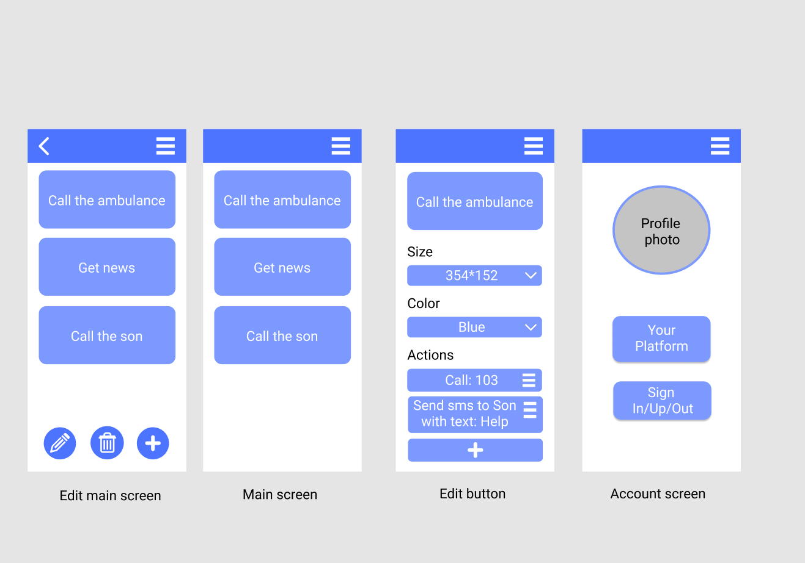

# easyphone

## Idea

Application solves the problem of difficulties with interacting with programs. By the way
application let user create a simplified UI by own self.

**Features:**
1. Create shortcut buttons.
2. Create macroses for buttons.
    * Open certain web-page
    * Open certain application (with certain)
    * Call certain number
    * Create SMS by certain template (for example, can use geolocation data in SMS)
    * Write an email by certain template
    * Extract certain data (time, weather, news via rss, etc)
3. Customize buttons:
    * Change font
    * Change color
    * Change size
4. Sign Up/In/Out account.
5. Synchonize data via account

**Screens:**
* Main screen - customized buttons are here
* Main screen in edit mode 
* Edit button screen
* Account screen

## Target audience

* Target audience of the application elderly and low-tech people that has trouble with several steps actions in their mobile (and who have someone to help them with installation), also people that often use similar actions could use macros to save their time.

> As an example application could suit businessman for fast calls or unemployed retiree to get favorite news or chanel in phone.
> So simplified interface will speed up interaction with phone and lower the entry threshold.
* The application will support english language and could be updated with several others.
* The application will be avalible for people with any purchasing power, because it will be for free.

## Our team

***Khmara Vladimir***  - `developer`

***Atiukov Oleksandr*** -`developer`

## Technical stack

* **Kotlin** 
* **NodeJs + Koa** - backend

(*Could be updated later*).

Application will support **Android 9.0** and later

## [Prototypes of application](https://www.figma.com/file/ELA9u3WLlwpWvMjtrkZjBk/Untitled?node-id=0%3A1)

