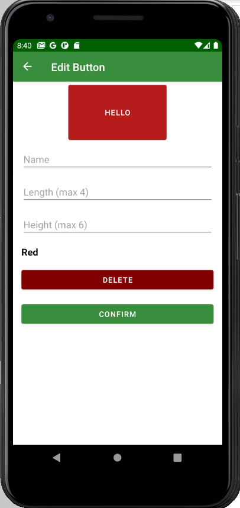

# Labs 3-5, 7

Reports for labs 3-4 and 5 are together, because big part of our UI is related to business logic and created programmatically. Our user can create buttons with different properties and assign different actions to them. Buttons with their parameters are saved in local Room database. Then they are extracted if needed. We used MVVM architecture.

### Files:
UI and Business logic (lab 3-5):
/res/layout/*
/res/navigation/*
com/example/easyphone/ui/*
com/example/easyphone/actions/*
com/example/easyphone/utils/FreePlaceFinder
com/example/easyphone/utils/ButtonsDisplayer

Storage (lab 7):
com/example/easyphone/db/*
com/example/easyphone/repository/ButtonsRepository

### Screenshots:
Navigation:

Screens in editor:

Working ui:

Main screen:

Menu:

Editor:

Button editor:

Color picker:

Action picker:

Action editor:

Created button:

Moving button:

Action performed: 

Editing existing button:

Validation errors:

Adaptivity:
