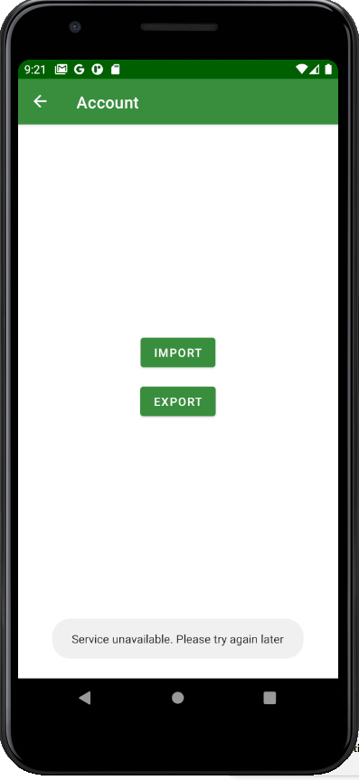
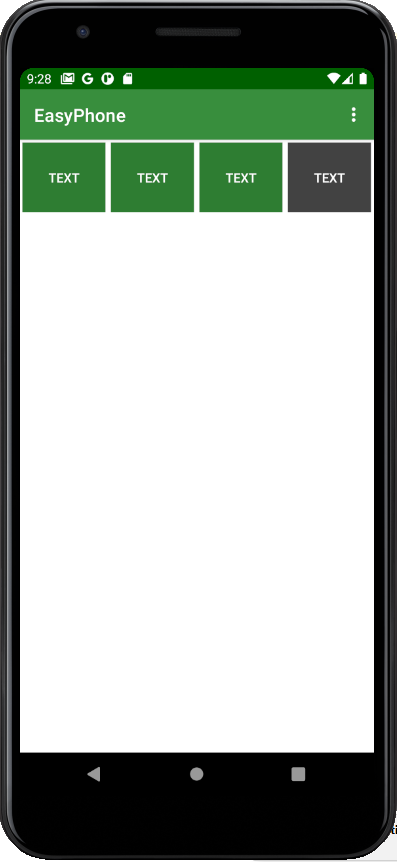

# Lab 6

We use retrofit2 for handling network calls. Also we use Google account tokens to save users data. 

You can find our NodeJs API here:
https://github.com/hmaravlad/easyphone-api

### Files:
com/example/easyphone/network/*
com/example/easyphone/repository/DataSyncRepository
com/example/easyphone/ui/account/*

### Screenshots:

Error example:

### Workflow:

Log in Google account: 

Current buttons:

Press **Export** on Account screen:

Delete couple of buttons:

Press **Import** on Account screen:

Get old buttons back:

