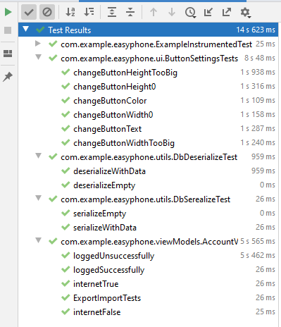
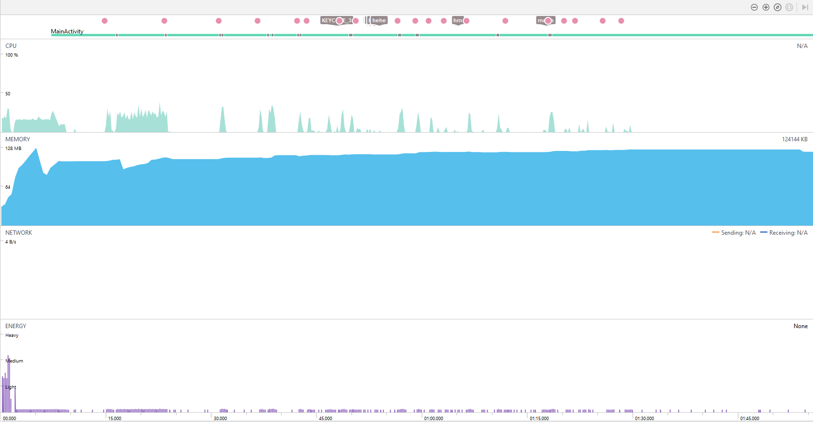

# Lab 9

We created tests for our import/export functionality and for edit button screen.

### Files:
com/example/easyphone/* (androidTest)

### Results:

### Profiling

We used default profiling tool. For profiling we executed simple workflow which consisted of creating three buttons

### Profiling results:

- Memory usage was about 128MB all the time
- Battery usage was low most of the time
- CPU usage was low most of the time and increased during some actions, for example, creating buttons